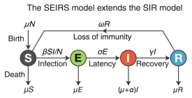
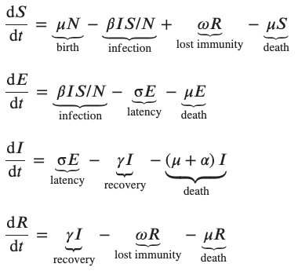
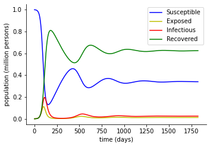

# The-SEIRS-model-for-infectious-disease-dynamics
Analysis of a **mathematical** and **statistical** model which is commonly used to study the spread of infectious diseases.

The simplest model for the spread of an infection is the SIR model, which tracks the fraction of a population in each of three groups: susceptible, infectious and recovered. The SEIRS model is more complicated since it contains new compartments (groups) and more complicated flows between them.

The SEIRS model has 4 groups: usceptible(S), infectious(I), recovered(R), and exposed(E). The graph below demonstrates the change of population in the mentioned groups:



According to the above graph, we assume that the total population size N is constant. All groups will experience death at a rate µ, and birth at a rate s. The life expectency in this population is 76 years, so 1/µ = 76. β% of the people are in contact with each other everyday. Upon being infected, individuals will move to the E group at a rate βSI/N. We assume that the contact rate in this population is 21%, so β=0.21/day. People remain in the E for an average period of 1/σ before moving into the I group. We assume that σ = 7 days. The recovery time for this disease is 14 days, and no one dies from this disease (only background deaths from other causes). Immunity after recovery is temporary and recovered individuals will lose immunity and return to S after an average protected period of 1/ω. We assume that 1/ω = 365 days. 

All of the rates mentioned above will lead to the system of differential equations below:



We assume that in the begginig, only 0.1% of the population are exposed to this disease, and we want to examine the population of each of the groups after 5 years.

Implementing the system of equations as below:

```ruby
def f(xi,yi,**par): 
    Si,Ei,Ii,Ri = yi[0],yi[1],yi[2],yi[3] 
    mu = par["mu"]
    beta = par["beta"]
    gamma = par["gamma"]
    alpha = par["alpha"]
    omega=par["omega"]
    sigma = par["sigma"]
    N = par["N"]
    f_=[
      mu*N - beta*Ii*Si/N + omega*Ri - mu*Si,
      beta*Ii*Si/N - sigma*Ei - mu*Ei,
      sigma*Ei - gamma*Ii - (mu+alpha)*Ii,
      gamma*Ii - omega*Ri - mu*Ri  
    ]
    return f_
```

By using the **Runge-Kutta** method, and implementing the coefficients k1, k2, k3, and k4 in the code, the final model can be implemented as below:

The results:



Using the **Simpson's rule** to find the percentage of the infected people in the total of 5 years:

The results is as follows:
  
```
percentage of infected people is = 2.7838616689614124
```

The percentage of the infected people in the total of 5 years, if if the contact rate becomes β/2:

```
percentage of infected people is = 1.28463437660091
```

Finding the day in which the number of infected people is maximum, using the **Newton-Raphson method**:

```ruby
def NEW_RAPH (t):
    fx=Pn_prime.evalf(subs={x:t})
    return fx
    
def NEW_RAPH_derivative (t):
    df1=Pn_prime.diff(x)
    df=df1.evalf(subs={x:t})
    return df
    
while True:
    FXn=NEW_RAPH(Xn)
    fXn=NEW_RAPH_derivative(Xn)
    Xn1=Xn-(FXn/fXn)
    FXn1=NEW_RAPH(Xn1)
    n+=1
    if(abs(FXn1-FXn)>0.005):
        Xn=Xn1
    else:
        break
```

The results are as follows:

```
number of day that the infected people are maximum: 112
the maximum percentage of the infected people in a day = 0.19640596986414016
```
